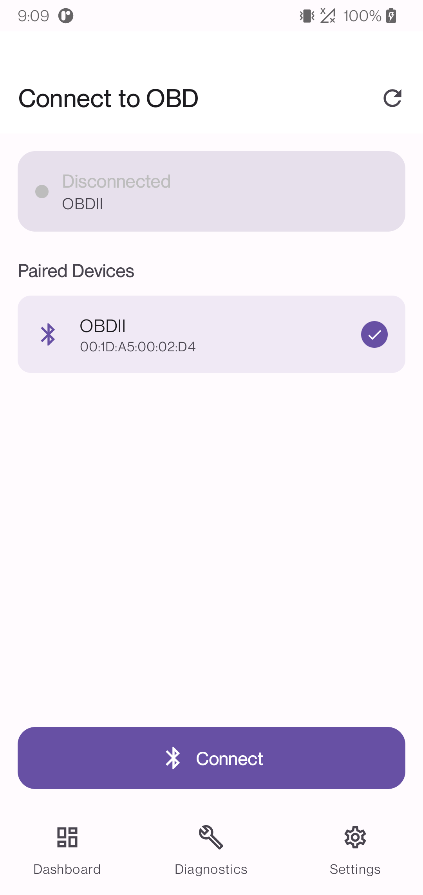
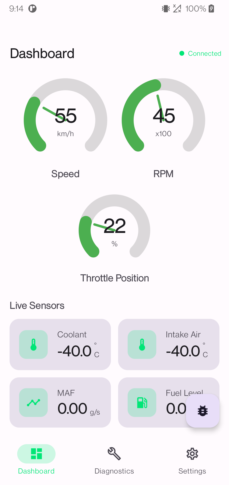
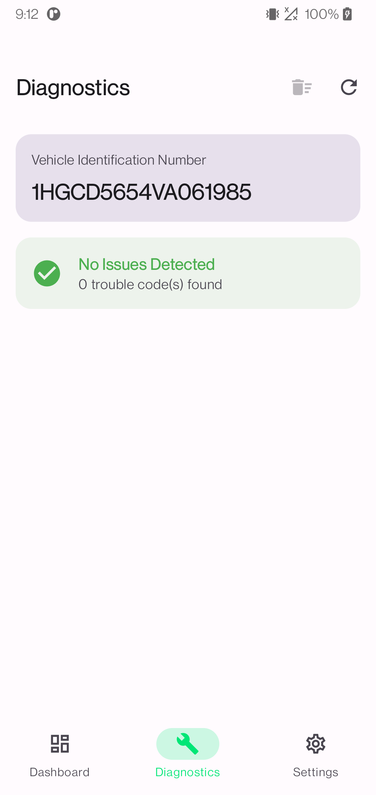
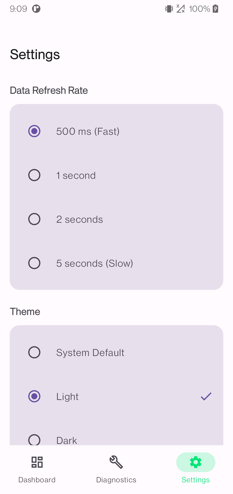

# obd-scanner-android


Open-source **Android OBD2 scanner** sample app showing a production-style integration of
[`kotlin-obd-api`](https://github.com/eltonvs/kotlin-obd-api) with modern Android architecture.

This repository is intended to be a canonical reference for developers who need to implement:

- **Bluetooth ELM327 connection** on Android (SPP / Bluetooth Classic)
- **Live OBD-II PID polling** (speed, RPM, coolant, throttle, etc.)
- **Vehicle diagnostics** (VIN + DTC parsing)
- **Jetpack Compose + Hilt + DataStore + Flow** architecture
- **Quality checks** (Lint, ktlint, detekt, unit tests)

---

## Table of Contents

- [Why this repository exists](#why-this-repository-exists)
- [Quick Start Guide](#quick-start-guide)
- [Demo](#demo)
- [Features](#features)
- [Tech Stack](#tech-stack)
- [Project Structure](#project-structure)
- [Architecture](#architecture)
- [Bluetooth + OBD Integration Deep Dive](#bluetooth--obd-integration-deep-dive)
- [OBD Commands Used](#obd-commands-used)
- [Permissions & Security Model](#permissions--security-model)
- [State Management](#state-management)
- [Settings & Persistence](#settings--persistence)
- [Setup Guide](#setup-guide)
- [Build & Run](#build--run)
- [Quality Gates](#quality-gates)
- [Testing](#testing)
- [Compatibility Notes](#compatibility-notes)
- [Troubleshooting](#troubleshooting)
- [Roadmap](#roadmap)
- [Contributing](#contributing)
- [SEO / Discoverability Tips (for maintainers)](#seo--discoverability-tips-for-maintainers)

---

## Why this repository exists

Many OBD Android repos are either:

- outdated examples,
- tightly coupled codebases,
- or missing architecture/testing guidance.

`obd-scanner-android` focuses on being:

- **current** (Kotlin + Compose + modern Android tooling),
- **educational** (clear architecture boundaries),
- **practical** (real Bluetooth + OBD command flow),
- **extensible** (easy to add more commands/transports).

If you're building an app around **ELM327**, **vehicle telemetry**, or **Android diagnostics tools**, this repo is designed to be your starting point.

---

## Quick Start Guide

If you're new to Android OBD2 apps, start here first. This section is intentionally practical and step-by-step.

### 1) What you need

- An Android phone/tablet with Bluetooth
- An ELM327-compatible **Bluetooth Classic (SPP)** OBD-II adapter
- A vehicle with an OBD-II port
- Android Studio + JDK 17 (if you want to build from source)

### 2) Build and run

```bash
./gradlew assembleDebug
```

Install and open the app from Android Studio (or install APK via adb).

### 3) Pair your adapter first (important)

Before using the app:

1. Open Android Bluetooth settings
2. Pair with your OBD adapter
3. Return to the app

The app reads from **paired devices** (it does not run active Bluetooth discovery yet).

### 4) First-run walkthrough

1. Open **Connection** screen
2. Grant requested Bluetooth/location permissions
3. Select your paired OBD adapter
4. Tap **Connect**
5. Once connected, open:
   - **Dashboard** for live metrics (speed/RPM/etc.)
   - **Diagnostics** for VIN and DTCs

### 5) Common beginner issues

- **“Device not listed”**
  - usually means adapter is not paired at OS level
- **“Connected but no values”**
  - some ECUs do not expose all PIDs
  - try another vehicle or increase polling interval
- **“Permission denied / security exception”**
  - re-open app settings and allow Bluetooth permissions

### 6) Quick glossary

- **OBD-II**: standard vehicle diagnostics interface
- **ELM327**: common adapter chipset used by Bluetooth OBD dongles
- **PID**: parameter ID used to request sensor data (e.g., speed)
- **DTC**: Diagnostic Trouble Code (fault code)
- **VIN**: Vehicle Identification Number
- **MIL**: Malfunction Indicator Lamp (check-engine status)

### 7) More project details

The remaining sections in this README cover the implementation in depth, including:

- architecture layers (UI/domain/data)
- repository + transport internals
- kotlin-obd-api command integration
- quality tooling and testing strategy

---

## Demo

### Screenshots

| Connection | Dashboard |
|---|---|
|  |  |

| Diagnostics | Settings |
|---|---|
|  |  |

---

## Features

### Connection
- Runtime permission request flow for Bluetooth access
- List paired devices
- Connect/disconnect to ELM327-compatible adapter
- Connection state (`Disconnected`, `Connecting`, `Connected`, `Error`)

### Live Dashboard
- Polling loop with configurable interval
- Live gauges and sensor cards
- In-app debug log viewer (command/response/error timeline)

### Diagnostics
- VIN retrieval
- Trouble code retrieval (Mode 03)
- Robust DTC parser:
  - direct standard-code extraction (`[PCBU][0-3][0-9A-F]{3}`)
  - hex fallback decoding to canonical 5-char codes
  - filters noise (`NO DATA`, `P0000`, duplicates)

### Settings
- Polling interval configuration
- System/light/dark theme selection
- Auto-connect to previous device

---

## Tech Stack

- **Language:** Kotlin
- **UI:** Jetpack Compose + Material 3
- **DI:** Hilt
- **Concurrency:** Coroutines + Flow
- **Persistence:** DataStore Preferences
- **OBD Library:** `com.github.eltonvs:kotlin-obd-api:v1.4.1`
- **Static Analysis:** Android Lint + ktlint + detekt
- **Testing:** JUnit4 + MockK + Turbine + coroutines-test

Build configuration:

- Compile SDK: `36`
- Min SDK: `24`
- Java target: `17`

---

## Project Structure

```text
app/src/main/kotlin/com/eltonvs/obdapp/
├── data/
│   ├── connection/
│   │   ├── ObdTransport.kt
│   │   └── BluetoothTransport.kt
│   ├── di/
│   │   ├── RepositoryModule.kt
│   │   └── TransportModule.kt
│   └── repository/
│       └── ObdRepositoryImpl.kt
├── domain/
│   ├── model/
│   ├── repository/
│   │   └── ObdRepository.kt
│   └── usecase/
├── ui/
│   ├── components/
│   ├── feature/
│   │   ├── connection/
│   │   ├── dashboard/
│   │   ├── diagnostics/
│   │   └── settings/
│   ├── navigation/
│   ├── theme/
│   └── MainActivity.kt
├── util/
│   ├── LogManager.kt
│   └── PreferencesManager.kt
└── ObdSampleApp.kt
```

---

## Architecture

Layered architecture with clean separation:

- **UI layer**: composables + ViewModels (presentation state)
- **Domain layer**: use cases + repository contract + domain models
- **Data layer**: repository implementation + transport implementation + external library integration

### Data flow

```text
Compose Screen
   -> ViewModel
      -> UseCase
         -> ObdRepository (interface)
            -> ObdRepositoryImpl
               -> ObdTransport (BluetoothTransport)
               -> kotlin-obd-api commands
```

### Why this architecture works

- UI remains free from transport protocol details
- business actions are explicit and testable
- swapping transport implementation is straightforward

---

## Bluetooth + OBD Integration Deep Dive

## 1) Device connection sequence

1. User selects a paired adapter in `ConnectionScreen`
2. `ConnectionViewModel.connect()` invokes `ConnectDeviceUseCase`
3. `ObdRepositoryImpl.connect()`:
   - validates `BLUETOOTH_CONNECT` permission
   - delegates socket creation/connection to `BluetoothTransport`
   - creates `ObdDeviceConnection(inputStream, outputStream)`
   - performs adapter bootstrap:
     - `ATZ` (`ResetAdapterCommand`)
     - `ATE0` (`SetEchoCommand(Switcher.OFF)`)

## 2) Polling lifecycle

- Dashboard starts polling only when connected
- Polling executes on IO coroutine scope
- Commands are executed each cycle and emitted as domain metrics
- Disconnect cancels polling and closes transport safely

## 3) Diagnostics lifecycle

- `DiagnosticsViewModel` owns diagnostics screen state
- Reads VIN and trouble codes on demand / when connected
- Applies resilient DTC normalization before UI rendering

---

## OBD Commands Used

| Purpose | Command Class | Typical PID/Mode |
|---|---|---|
| Reset adapter | `ResetAdapterCommand` | `ATZ` |
| Echo off | `SetEchoCommand(Switcher.OFF)` | `ATE0` |
| Vehicle speed | `SpeedCommand` | `010D` |
| Engine RPM | `RPMCommand` | `010C` |
| Coolant temp | `EngineCoolantTemperatureCommand` | `0105` |
| Intake air temp | `AirIntakeTemperatureCommand` | `010F` |
| MAF | `MassAirFlowCommand` | `0110` |
| Throttle position | `ThrottlePositionCommand` | `0111` |
| Fuel level | `FuelLevelCommand` | `012F` |
| VIN | `VINCommand` | Mode 09 |
| Trouble codes | `TroubleCodesCommand` | Mode 03 |

---

## Permissions & Security Model

Manifest permissions:

- `BLUETOOTH` / `BLUETOOTH_ADMIN` (for API <= 30)
- `BLUETOOTH_CONNECT`
- `BLUETOOTH_SCAN`
- `ACCESS_FINE_LOCATION`
- `ACCESS_COARSE_LOCATION`

Runtime permission request is handled in `ConnectionScreen`.

Defensive checks in data layer:

- repository/transport guard sensitive calls with permission checks
- sensitive Bluetooth calls handle `SecurityException` gracefully

---

## State Management

- Repository exposes `StateFlow<ConnectionState>` for connection status
- Metrics are streamed as Flow events
- Screens consume state with `collectAsStateWithLifecycle()`

This keeps UI reactive and lifecycle-safe.

---

## Settings & Persistence

`PreferencesManager` (DataStore) stores:

- polling interval
- theme (`system` default)
- last connected device metadata
- auto-connect flags

Auto-connect flow:

- app checks persisted state at startup
- if enabled and valid device exists, reconnect attempt is triggered

---

## Setup Guide

### Hardware prerequisites

- Android phone/tablet (Bluetooth capable)
- ELM327-compatible OBD-II adapter (Bluetooth Classic/SPP)
- Vehicle with OBD-II port

### Pairing

1. Pair adapter via Android system Bluetooth settings first
2. Open app and grant requested permissions
3. Select paired adapter and connect

---

## Build & Run

```bash
./gradlew assembleDebug
```

Then install via Android Studio or `adb install`.

---

## Quality Gates

Run full quality pipeline:

```bash
./gradlew check
```

Run individually:

```bash
./gradlew testDebugUnitTest
./gradlew lintDebug
./gradlew ktlintCheck
./gradlew :app:detekt
```

> `detekt` is wired as a custom Gradle task using `detekt-cli` for compatibility with the current AGP/Kotlin setup.

---

## Testing

Current test coverage includes:

- use case behavior
- ViewModel state transitions and error handling

Frameworks:

- `junit:junit`
- `io.mockk:mockk`
- `kotlinx-coroutines-test`
- `app.cash.turbine`

---

## Compatibility Notes

- This sample currently targets **Bluetooth Classic (SPP)** transport
- BLE transport is not yet implemented in this repository
- Not all ECUs expose all PIDs; missing sensor values may be expected on some vehicles

Toolchain note:

- AGP/KSP + built-in Kotlin currently requires compatibility handling in this project (`android.disallowKotlinSourceSets=false`)

---

## Troubleshooting

### Adapter not listed

- ensure adapter is paired at OS level first
- verify Bluetooth permissions are granted

### Connection fails quickly

- ensure adapter has power (ignition state)
- ensure no other app is currently connected to adapter
- unplug/replug adapter and retry

### No live values

- ECU may not support specific PIDs
- increase polling interval and retry
- test with another compatible vehicle

### Build issues

- ensure JDK 17
- run `./gradlew clean check`
- sync Gradle in Android Studio after dependency updates

---

## Roadmap

- [ ] BLE transport implementation
- [ ] richer DTC descriptions (lookup catalog)
- [ ] historical charts and export
- [ ] integration tests with fake transport
- [ ] sample video/GIF walkthrough in README

---

## Contributing

Contributions are welcome.

Please:

1. keep architecture boundaries clean (UI/domain/data)
2. run `./gradlew check` before PR
3. include tests for behavior changes
4. prefer focused, small PRs

---

## SEO / Discoverability Tips (for maintainers)

For better GitHub and Google discoverability, set the repo metadata:

### Suggested GitHub repository description

> Android OBD2 scanner sample app (Kotlin + Jetpack Compose) using kotlin-obd-api with Bluetooth ELM327 connection, live PID polling, and diagnostics.

### Suggested GitHub topics

`android` · `kotlin` · `jetpack-compose` · `obd2` · `obd-ii` · `elm327` · `bluetooth` · `vehicle-diagnostics` · `automotive` · `telematics`

### Suggested social preview image text

> "OBD Scanner Android — Kotlin + Compose + kotlin-obd-api"

### Suggested docs additions

- publish screenshots/GIFs under `docs/images`
- add `LICENSE` file
- add `CHANGELOG.md`
- add releases with APK/demo video links

---

## Repository Identity

- **Repository name:** `obd-scanner-android`
- **Goal:** canonical open-source Android sample for implementing `kotlin-obd-api`.
